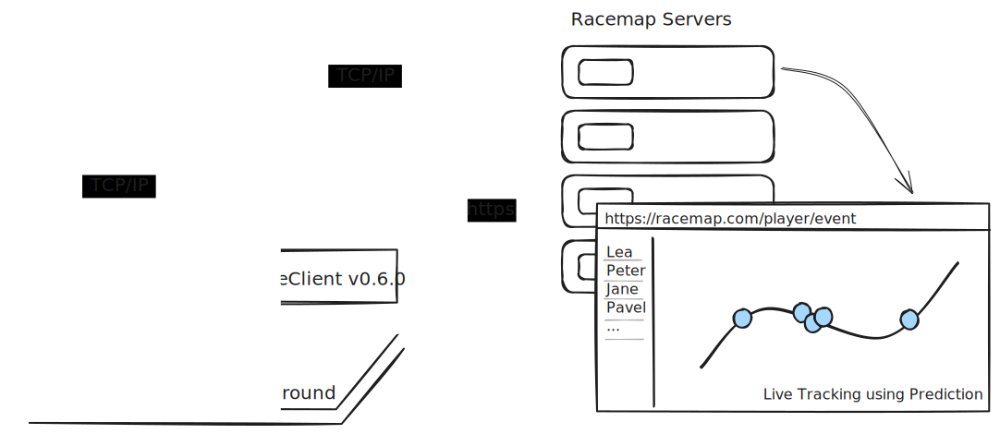

# 2-racemap-forwarder

Our forwarder service connects MyLaps and ChronoTrack timing systems with the RACEMAP backend to forward the reads/ detections from the timing system to racemap.com.
The service also manages the communication with the MyLaps|ChronoTrack software.

- opens a port, by default the port for MyLaps connections is **3097**
- opens a second port, by default the port for ChronoTrack connections is **3000**
- listens on localhost IP: **127.0.0.1**
- RACEMAP API token is needed to forward data to racemap.com
- API token is set by using the environment var **RACEMAP_API_TOKEN**



## How to use

1. Generate the API token for your RACEMAP account. It can be found in your user section.
2. Download the service to the computer on which the MyLaps timing software is running.
3. Run the service with the API token as an environment variable or add it using the user interface.
4. Configure your timing system to send data to the service.
5. The service will forward your data to racemap.com.
6. In case of wrong time zones of your local system you can override it.

## How to run the service

### I just want to use the service

You can download the latest binary for your platform from the here and run it with the following commands.

- [2-racemap-forwarder-win-x64-v1.0.4.exe](https://github.com/racemap/2-racemap-forwarder/releases/download/v1.1.0/2-racemap-forwarder-win-x64-v1.1.0.exe)
- [2-racemap-forwarder-1.1.0.AppImage](https://github.com/racemap/2-racemap-forwarder/releases/download/v1.1.0/2-racemap-forwarder-1.1.0.AppImage)
- [2-racemap-forwarder_1.1.0_amd64.snap](https://github.com/racemap/2-racemap-forwarder/releases/download/v1.1.0/2-racemap-forwarder_1.1.0_amd64.snap)

#### Windows

Please make shure that you excute the binary from a folder with write access, otherwise the application will not be able to create the log file.

You could also add the following lines to a start.bat file and run it from there. Then you can double click the start.bat file to run the service.

```bat
set RACEMAP_API_TOKEN=your-api-token
2-racemap-forwarder.exe
```

#### Linux

```bash
export RACEMAP_API_TOKEN=your-api-token
./2-racemap-forwarder
```

### I know what I am doing

You can checkout the repository and run the service with the following commands. (requires nodejs 18 and yarn 4 to be installed)

```bash
  git clone git@github.com:racemap/mylaps-to-racemap-forwarder.git
  cd 2-racemap-forwarder
  yarn install
  touch .env
  sed -i '/^RACEMAP_API_TOKEN=/d' .env && echo "RACEMAP_API_TOKEN=your-api-token" >> .env
  yarn start
```

## Possible settings

You can change the defaults of the service by overriding the following environment variables

| Variable           | Default             | Description                                                                                                   |
| ------------------ | ------------------- | ------------------------------------------------------------------------------------------------------------- |
| RACEMAP_API_TOKEN  | ''                  | The API Token is required to send data to RACEMAP                                                             |
| LISTEN_MODE        | private             | The mode the service listens on, can be private or public. private binds to 127.0.0.1 public binds to 0.0.0.0 |
| MYLAPS_LISTEN_PORT | 3097                | The port the mylaps service listens on                                                                        |
| CHRONO_LISTEN_PORT | 3000                | The port the chronotrack service listens on                                                                   |
| RACEMAP_API_HOST   | https://racemap.com | The host to send the requests to                                                                              |
