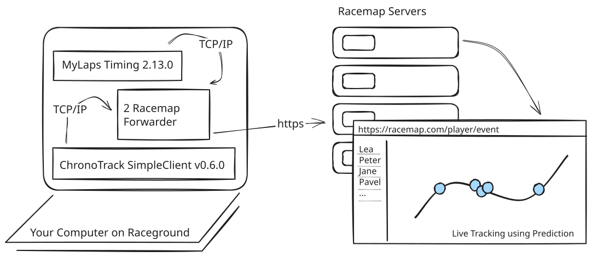

# 2-racemap-forwarder

Our forwarder service connects MyLaps and ChronoTrack timing systems with the RACEMAP backend to forward the reads/ detections from the timing system to racemap.com.
The service also manages the communication with the MyLaps|ChronoTrack software.

- opens a port, by default the port for MyLaps connections is **3097**
- opens a second port, by default the port for ChronoTrack connections is **3000**
- listens on localhost IP: **127.0.0.1**
- RACEMAP API token is needed to forward data to racemap.com
- API token is set by using the environment var **RACEMAP_API_TOKEN**



## How to use

1. Generate the API token for your RACEMAP account. It can be found in your user section.
2. Download the service to the computer on which the MyLaps timing software is running.
3. Run the service with the API token as an environment variable or add it using the user interface.
4. Configure your timing system to send data to the service.
5. The service will forward your data to racemap.com.
6. In case of wrong time zones of your local system you can override it.

## How to run the service

### I just want to use the service

Download the latest version for your system:

| System | Download |
| --- | --- |
| Windows (installer) | [2-racemap-forwarder-win-x64-setup.exe](https://github.com/racemap/2-racemap-forwarder/releases/latest/download/2-racemap-forwarder-win-x64-setup.exe) |
| Windows (portable, no install) | [2-racemap-forwarder-win-x64-portable.exe](https://github.com/racemap/2-racemap-forwarder/releases/latest/download/2-racemap-forwarder-win-x64-portable.exe) |
| macOS (Apple Silicon) | [2-racemap-forwarder-mac-arm64.dmg](https://github.com/racemap/2-racemap-forwarder/releases/latest/download/2-racemap-forwarder-mac-arm64.dmg) |
| macOS (Intel) | [2-racemap-forwarder-mac-x64.dmg](https://github.com/racemap/2-racemap-forwarder/releases/latest/download/2-racemap-forwarder-mac-x64.dmg) |
| Linux (AppImage) | [2-racemap-forwarder-linux-x64.AppImage](https://github.com/racemap/2-racemap-forwarder/releases/latest/download/2-racemap-forwarder-linux-x64.AppImage) |
| Linux (deb) | [2-racemap-forwarder-linux-x64.deb](https://github.com/racemap/2-racemap-forwarder/releases/latest/download/2-racemap-forwarder-linux-x64.deb) |

Checksums are in `SHA256SUMS.txt` on the [release page](https://github.com/racemap/2-racemap-forwarder/releases/latest). The version you are running is shown next to the title. Click the copy icon and paste it when you contact support.

#### macOS

The app is not notarized by Apple yet. On the first start, right-click the app and choose **Open**, then confirm. On macOS 15 and newer go to **System Settings → Privacy & Security** and click **Open Anyway**.

#### Windows

Please make shure that you excute the binary from a folder with write access, otherwise the application will not be able to create the log file.

You could also add the following lines to a start.bat file and run it from there. Then you can double click the start.bat file to run the service.

```bat
set RACEMAP_API_TOKEN=your-api-token

# change port below if you want to connect from MyLaps having a diffrent port
set MYLAPS_LISTEN_PORT=2097

# change port below if you want to connect from ChronoTrack having a diffrent port
set CHRONO_LISTEN_PORT=3000

# change below location according to zour installation directory
C:\Users\neptuntriton\AppData\Local\Programs\2-racemap-forwarder\2-racemap-forwarder.exe
```

#### Linux

```bash
export RACEMAP_API_TOKEN=your-api-token
./2-racemap-forwarder
```

### I know what I am doing

You need Node.js 22 and Yarn 4 (`corepack enable`).

```bash
git clone git@github.com:racemap/2-racemap-forwarder.git
cd 2-racemap-forwarder
yarn install
echo "RACEMAP_API_TOKEN=your-api-token" >> .env
yarn dev
```

| Command | What it does |
| --- | --- |
| `yarn dev` | Runs the app with hot reload |
| `yarn check` / `yarn fix` | Lint and format with Biome |
| `yarn typecheck` | TypeScript for main and renderer |
| `yarn test` | Unit tests (Vitest), also run in CI |
| `yarn test:live` | Integration tests against racemap.com (needs `RACEMAP_API_TOKEN`) |
| `yarn build-linux` / `build-win` / `build-mac` | Local binaries in `dist/` |

## Possible settings

You can change the defaults of the service by overriding the following environment variables

| Variable               | Default             | Description                                                                                                   |
| ---------------------- | ------------------- | ------------------------------------------------------------------------------------------------------------- |
| RACEMAP_API_TOKEN      | ''                  | The API Token is required to send data to RACEMAP                                                             |
| LISTEN_MODE            | private             | The mode the service listens on, can be private or public. private binds to 127.0.0.1 public binds to 0.0.0.0 |
| MYLAPS_LISTEN_PORT     | 3097                | The port the mylaps service listens on                                                                        |
| MYLAPS_PREFIX_OVERRIDE | 'MyLaps\_'          | Overrides the prefix for all MyLaps transponder IDs when forwarded to racemap.                                |
| CHRONO_LISTEN_PORT     | 3000                | The port the chronotrack service listens on                                                                   |
| CHRONO_PREFIX_OVERRIDE | 'Chrono\_'          | Overrides the prefix for all Chrono transponder IDs when forwarded to racemap.                                |
| RACEMAP_API_HOST       | https://racemap.com | The host to send the requests to                                                                              |

# Releases

Release notes are on the [releases page](https://github.com/racemap/2-racemap-forwarder/releases). Versions follow [semver](https://semver.org): `vMAJOR.MINOR.PATCH`.

To cut a release from an up-to-date `main`:

```bash
./tools/release/release.sh            # patch: v1.2.0 -> v1.2.1
./tools/release/release.sh --minor    # v1.2.1 -> v1.3.0
./tools/release/release.sh --dry-run  # show what would happen
```

The script bumps `package.json`, tags and pushes, and creates a draft release with AI-written notes that you review in your editor. The tag starts the [release workflow](.github/workflows/release.yml), which builds Windows, macOS and Linux and publishes the release when all builds are green.
